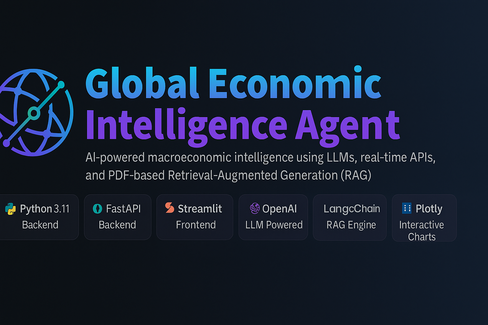

<p align="center">
  
</p>

<h1 align="center">🌍 Global Economic Intelligence Agent</h1>

<p align="center">
  <strong>AI-powered macroeconomic intelligence using LLMs, real-time APIs, and PDF-based Retrieval-Augmented Generation (RAG)</strong>
</p>

<p align="center">
  
  
  
  
  
  
  
</p>

<br>

<p align="center">
  <em>An advanced, full-stack AI system that blends macroeconomic data, interactive dashboards, and retrieval-augmented reasoning into a single intelligence platform.</em>
</p>

<br>

# Global Economic Intelligence Agent  
**AI-powered macroeconomic insights using real-time data, PDF-based RAG, and LLM analysis**

---

## Overview  
The **Global Economic Intelligence Agent** is a production-ready AI application that delivers analyst-grade economic insights by combining:

✔ **Live macroeconomic data** (GDP, inflation, unemployment)  
✔ **PDF-based Retrieval-Augmented Generation** (IMF, ECB, OECD reports)  
✔ **LLM reasoning** for synthesis and forecasting  
✔ **Interactive visualizations** with neon dark-mode design  
✔ **One-click PDF report generation** for stakeholders  

This project demonstrates full-stack AI engineering with a polished UX and explainable outputs.

---

## Features  

### 🔵 1. Real-Time Macroeconomic Dashboard  
- Live API calls to World Bank Indicators  
- Country-smart UI with flag recognition  
- Neon Plotly charts + sparkline mini-trends  
- Responsive, cyberpunk-inspired theme  

---

### 🟣 2. Global Economic Heatmap  
- Quick comparison across major economies  
- Dark neon map with hover interactions  

---

### 🟢 3. Ask the AI Economist  
- Structured LLM answers (country detected, indicators used)  
- RAG-enhanced insights grounded in real reports  
- Optional Text-to-Speech (TTS) playback  

---

### 🟠 4. PDF RAG Engine  
- Ingests and vectorizes PDF economic reports  
- Returns relevant excerpts to support analysis  

---

### 🟡 5. Exportable Intelligence  
- One-click **PDF economic briefing**  

---

## Tech Stack  

### **Backend**  
- FastAPI  
- LangChain for embeddings & retrieval  
- ChromaDB vector store  
- Requests → World Bank API  
- ReportLab → PDF generation  

### **Frontend**  
- Streamlit  
- Plotly (dark neon charts)  
- Custom CSS (glass + cyberpunk theme)  
- gTTS (optional voice output)

---

## Repository Structure  

```
src/
  backend/
    server.py
    routes/
    rags/
  frontend/
    streamlit_app.py
data/
  pdfs/
  ingested/
screenshots/
README.md
```

---

## Running Locally  

```bash
git clone <YOUR_REPO_URL>
cd economics-agent
python -m venv .venv
.\.venv\Scriptsctivate
pip install -r requirements.txt

# Start backend
uvicorn src.backend.server:app --reload --port 8000

# Start frontend
streamlit run src/frontend/streamlit_app.py
```

## Why This Project Matters  
This project demonstrates the ability to:

- Build **end-to-end AI systems** (data → retrieval → LLM → UX)  
- Integrate **real-time APIs** with economic logic  
- Create **interactive dashboards** for decision makers  
- Deliver **explainable insights grounded in source documents**  
- Package AI into a **professional, deployable application**

Ideal for roles in:
- AI Engineering  
- Data Science  
- NLP / RAG Development  
- Quant/FinTech  
- Data Infrastructure  
- LLM Operations  

---

## Contact  
If you’re hiring or want to collaborate:

**LinkedIn:** https://www.linkedin.com/in/nicholai-gay-201905148/ 
**GitHub:** https://github.com/QinnniQ
