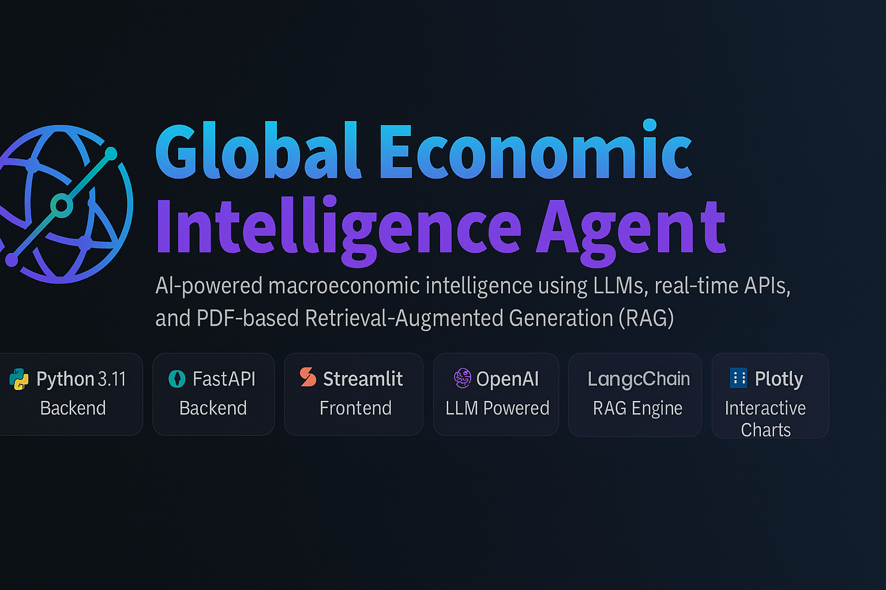
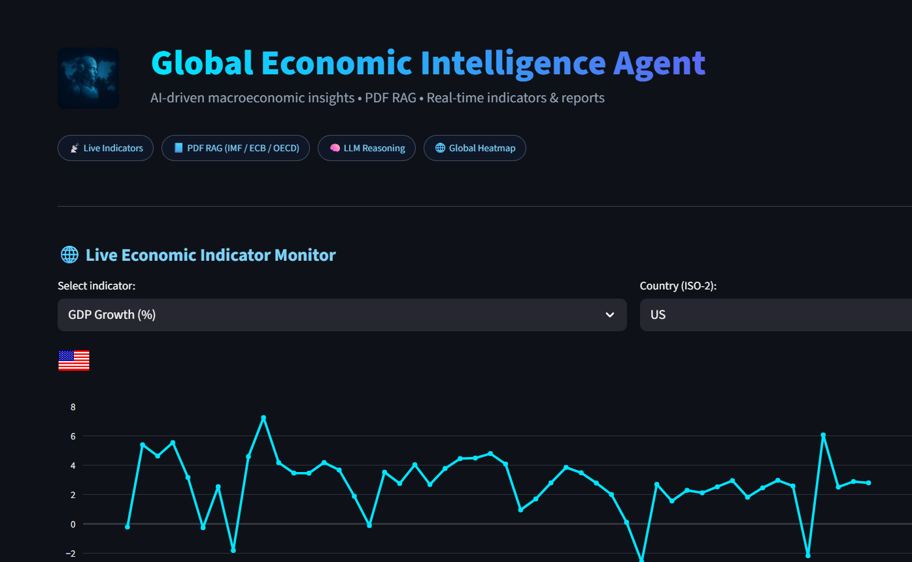
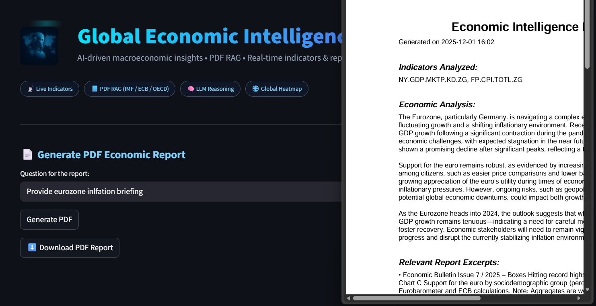
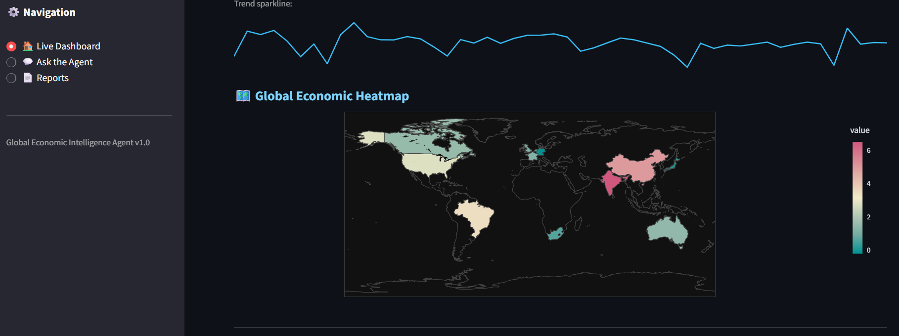

<p align="center">
  
</p>

<h1 align="center">🌍 Global Economic Intelligence Agent</h1>

<p align="center">
  <strong>AI-powered macroeconomic intelligence using live data, PDF-based RAG, and LLM analysis</strong>
</p>

<p align="center">
  
  
  
  
  
  
  
</p>

<p align="center">
  <em>A production-minded full-stack AI application combining real-time macroeconomic indicators, document retrieval, and LLM-based synthesis.</em>
</p>

---

## Overview

The **Global Economic Intelligence Agent** combines live macroeconomic data with document retrieval and LLM reasoning to produce grounded economic analysis through an interactive web interface.

It brings together:

- **Live macroeconomic indicators** such as GDP growth, inflation, and unemployment
- **PDF-based Retrieval-Augmented Generation (RAG)** over economic reports
- **LLM synthesis** that combines retrieved context with current indicator data
- **Interactive dashboards and global visualizations**
- **Exportable PDF economic briefings**

The project is designed as an end-to-end AI system rather than a standalone prompt demo: data retrieval, RAG, backend APIs, LLM analysis, visualization, and report generation are separated into distinct application layers.

---

## Architecture

```text
User
  ↓
Streamlit UI
  ↓
FastAPI backend
  ├── Live macro data → World Bank API
  ├── PDF retrieval → ChromaDB
  └── LLM analysis → OpenAI
  ↓
Grounded analysis + charts + PDF report
```

---

## Screenshots

### Main Dashboard


### AI Economic Report Generator


### Global Economic Heatmap


---

## Features

### 1. Real-Time Macroeconomic Dashboard
- Live World Bank indicator data
- GDP growth, inflation, and unemployment views
- Country-aware dashboard controls
- Plotly trend visualizations and sparklines

### 2. Global Economic Heatmap
- Cross-country indicator comparison
- Interactive geographic visualization

### 3. Ask the AI Economist
- Country and indicator detection from user questions
- LLM-generated macro trend summaries
- RAG-enhanced analysis grounded in retrieved report excerpts
- Combined reasoning over live data and document context

### 4. PDF RAG Engine
- Ingests and vectorizes economic reports
- Stores embeddings in ChromaDB
- Retrieves relevant passages to support generated analysis

### 5. Exportable Economic Briefings
- Generates downloadable PDF reports
- Includes detected country, indicators, analysis, and retrieved context

---

## Tech Stack

### Backend
- Python
- FastAPI
- OpenAI API
- LangChain
- ChromaDB
- World Bank API
- ReportLab

### Frontend
- Streamlit
- Plotly
- Pandas
- Custom CSS
- gTTS for optional audio playback

---

## Repository Structure

```text
.
├── assets/
├── chroma_store/
├── data/
├── reports_out/
├── screenshots/
├── src/
│   ├── agent/
│   │   └── economic_agent.py
│   ├── backend/
│   │   ├── rags/
│   │   ├── routes/
│   │   ├── tools/
│   │   ├── config.py
│   │   └── server.py
│   └── frontend/
│       └── streamlit_app.py
├── .env.example
├── .gitignore
├── requirements.txt
└── README.md
```

---

## Running Locally

### 1. Clone the repository

```bash
git clone https://github.com/QinnniQ/global-economic-intelligence-agent.git
cd global-economic-intelligence-agent
```

### 2. Create and activate a virtual environment

Windows PowerShell:

```powershell
py -3.11 -m venv .venv
.\.venv\Scripts\Activate.ps1
```

macOS / Linux:

```bash
python3.11 -m venv .venv
source .venv/bin/activate
```

### 3. Install dependencies

```bash
pip install -r requirements.txt
```

### 4. Configure environment variables

Copy the example file:

Windows PowerShell:

```powershell
Copy-Item .env.example .env
```

macOS / Linux:

```bash
cp .env.example .env
```

Then add your OpenAI API key to `.env`:

```env
OPENAI_API_KEY=your_openai_api_key_here
MODEL=gpt-4o-mini
```

The real `.env` file is excluded from Git.

### 5. Start the FastAPI backend

```bash
uvicorn src.backend.server:app --reload --port 8000
```

Health check:

```text
http://127.0.0.1:8000/health
```

FastAPI documentation:

```text
http://127.0.0.1:8000/docs
```

### 6. Start the Streamlit frontend

Open a second terminal, activate the same environment, then run:

```bash
streamlit run src/frontend/streamlit_app.py
```

The frontend expects the backend at:

```text
http://localhost:8000
```

---

## Engineering Decisions

- **Separate frontend and backend:** Streamlit handles presentation while FastAPI exposes application capabilities as API routes.
- **Live data + RAG:** structured macroeconomic indicators and unstructured report excerpts are combined rather than relying on a single context source.
- **Explicit retrieval layer:** ChromaDB provides inspectable document retrieval before LLM synthesis.
- **Environment-based secrets:** API keys are loaded from `.env` and never committed.
- **Health endpoint:** the backend exposes `/health` for basic service verification.

---

## Current Status

The application currently runs locally as a multi-service Python application with a FastAPI backend and Streamlit frontend.

The next engineering phase is focused on making the project easier to test, package, and deploy reproducibly:

- Docker / Docker Compose
- automated tests
- GitHub Actions CI
- deployment configuration
- logging and observability

These are intentionally listed as roadmap items rather than presented as completed functionality.

---

## What This Project Demonstrates

- End-to-end LLM application engineering
- Retrieval-Augmented Generation over real documents
- Integration of live external APIs with LLM workflows
- FastAPI backend design
- Vector retrieval with ChromaDB
- Interactive Streamlit application development
- Structured separation between retrieval, reasoning, API, and presentation layers
- Exportable stakeholder-facing outputs

---

## Contact

**Nicholai Gay**  
AI Engineer — LLM Systems, RAG & AI Agents

[LinkedIn](https://www.linkedin.com/in/nicholai-gay-201905148/) · [GitHub](https://github.com/QinnniQ)
